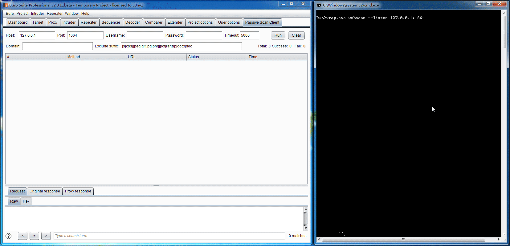
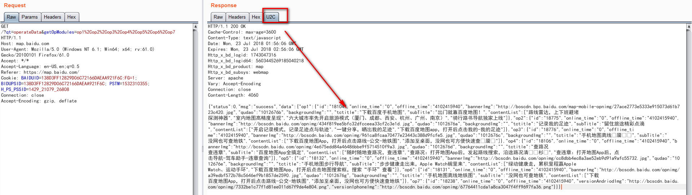
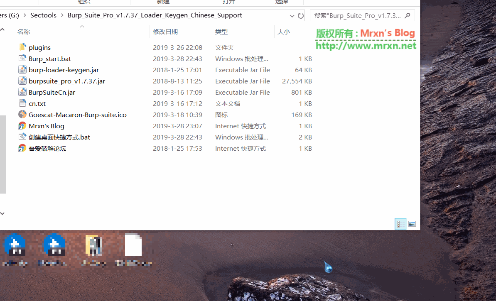
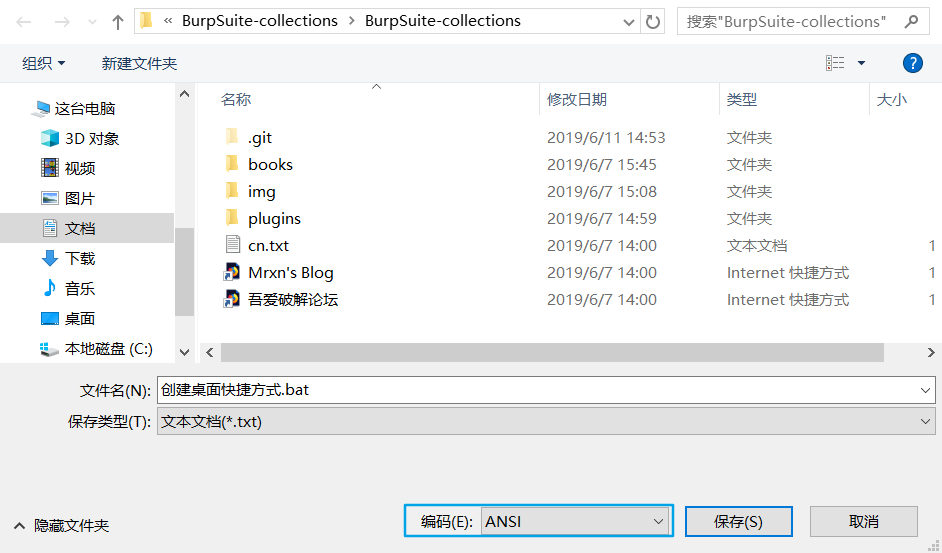
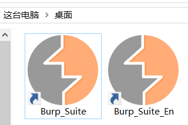

# Burp-Suite-collections

#### BurpSuite 相关收集项目，插件主要是非BApp Store（商店）

> 所有的破解汉化或者使用burpsuite都是在你配置好了Java环境的前提下！！！[相关教程](./books/如何在64位Windows%2010下安装java开发环境.pdf)  

### burpsuite pro 1.37 crack 破解: [中文版](./books/burpsuite破解-汉化-使用指导.docx) [英文版](./crack.md)    

### 打包了基本的burp,插件和汉化包等: [下载](https://github.com/Mr-xn/BurpSuite-collections/releases)  
### [BurpSuite_pro_v2.1破解版.rar](https://mir.cr/1XKFLGFW)
### [Burp_Suite_Pro_v2.1.04_Loader_Keygen](https://mir.cr/MZVYTZIL)
> (有能力请支持正版，本项目仅用于学习研究使用！)  

### [渗透测试面试问题2019版](渗透测试面试问题2019版.md)
<details>

<summary>文件列表</summary> 

```

+--- books
|   +--- Burp Suite使用 _ Pa55w0rd 's Blog.pdf
|   +--- Burp Suite使用中的一些技巧.pdf
|   +--- burp 日志插件「burplogger++.jar」从原理到实践-信安之路.pdf
|   +--- BurpSuite 代理设置的小技巧.pdf
|   +--- burpsuite实战指南.pdf
|   +--- Configuring Burp Suite with Android Nougat.pdf
|   +--- IOS之Burpsuite抓Https问题.pdf
|   +--- nmap-man-page.pdf
|   +--- Nmap渗透测试思维导图.png
|   +--- readme.md
|   +--- 利用Burpsuite爆破Tomcat密码.pdf
|   +--- 利用burp插件Hackvertor绕过waf并破解XOR加密 - 嘶吼 RoarTalk.pdf
|   +--- 基于BurpSuite快速探测越权-Authz插件.pdf
|   +--- 如何在64位Windows 10下安装java开发环境.pdf
|   +--- 新手福利 _ Burpsuite你可能不知道的技巧.pdf
|   +--- 本地文件包含漏洞检测工具 – Burp国产插件LFI scanner checks.pdf
+--- burp-loader-keygen.jar
+--- BurpSuiteCn.jar
+--- burpsuite_pro_v1.7.37.jar
+--- Burp_start.bat
+--- Burp_start_en.bat
+--- cn.txt
+--- crack.md
+--- Create-Desktop-Link.bat
+--- GitZip-for-github_v0.3.1.crx
+--- img
|   +--- ANSI.png
|   +--- BurpSuite破解版汉化脚本.gif
|   +--- crack1.png
|   +--- crack2.png
|   +--- crack3.png
|   +--- crack4.png
|   +--- crack5.png
|   +--- crack_ok.png
|   +--- CRLF_ANSI.png
|   +--- desktop_shortlink.png
|   +--- Goescat-Macaron-Burp-suite.ico
|   +--- hackbar.gif
|   +--- passive-scan-client-0.1-jar-with-dependencies.gif
|   +--- u2cTab.png
+--- Mrxn's Blog.url
+--- plugins
|   +--- awesome-burp-extensions
|   |   +--- README.md
|   +--- burp-vulners-scanner-1.2.jar
|   +--- bypasswaf.jar
|   +--- chunked-coding-converter.0.2.1.jar
|   +--- domain_hunter-v1.4.jar
|   +--- HackBar.jar
|   +--- jsEncrypter.0.3
|   |   +--- jsEncrypter-0.3.jar
|   |   +--- jsEncrypter_readme.pdf
|   |   +--- nodejs_server.js
|   |   +--- phantomjs_server.js
|   |   +--- README.md
|   |   +--- 对登录中账号密码进行加密之后再传输的爆破的思路和方式 - FreeBuf互联网安全新媒体平台.pdf
|   |   +--- 编写加密传输爆破插件jsEncrypter _ 回忆飘如雪.pdf
|   +--- knife-v1.5.jar
|   +--- LFI scanner checks.jar
|   +--- LoggerPlusPlus.jar
|   +--- passive-scan-client-0.1-jar-with-dependencies.jar
|   +--- Readme.md
|   +--- reCAPTCHA-v0.9.jar
|   +--- sqlmap.jar
|   +--- sqlmap4burp-plus-plus-0.1-jar-with-dependencies.jar
+--- README.md
+--- 创建桌面快捷方式.bat
+--- 创建桌面快捷方式.zip
+--- 吾爱破解论坛.url
+--- 渗透测试面试问题2019版.md

```
</details>  

##### 插件目录 plugins 介绍:

> plugins目录下新增[awesome-burp-extensions的翻译版本](./plugins/awesome-burp-extensions)  

- **httpsmuggler.jar** --- 一款辅助绕过WAF的插件，[详细说明](https://github.com/nccgroup/BurpSuiteHTTPSmuggler)
- **http-request-smuggler-all.jar** ---HTTP走私攻击检查插件，相关文章：[记一次走私请求学习](https://xz.aliyun.com/t/6299)
- **sqlmap4burp-plus-plus-0.1-jar-with-dependencies.jar** ---多平台无需外部依赖的burp联动sqlmap插件，使用也很简单，导入在burp拦截的请求里或者重放都可以直接发送到sqlmap4burp界面，第一次需要选择sqlmap.py文件位置进行设置，详细的可以看[飘雪表哥-c0ny1源处](https://github.com/c0ny1/sqlmap4burp-plus-plus)。
- **passive-scan-client-0.1-jar-with-dependencies.jar** --- Burp被动扫描流量转发插件,比如搭配长亭的[`XRAY`](https://github.com/chaitin/xray)来进行被动扫描，借用群里表哥的话:~~挂着坐收洞~~。[详细说明](https://github.com/c0ny1/passive-scan-client/blob/master/README.md),演示动图: 

- **domain_hunter-1.4.jar** --- 利用 burp 收集整个企业、组织的域名（不仅仅是单个主域名）的插件。[详细说明](https://github.com/bit4woo/domain_hunter/blob/master/README.md)

- **reCAPTCHA.v0.9.jar** --- Burpsuite intruder 用于爆破模块验证码的自动识别插件，详细使用请看这里：[使用说明](https://github.com/bit4woo/reCAPTCHA/blob/master/README.md)

- **knife-v1.5.jar** --- [bit4](https://github.com/bit4woo/knife/blob/master/README-zh.md)表哥开发的一款 `burpsuite` 增强功能插件，主要是增加右键菜单功能(包含 `hackbar++` 插件功能)，同时增加 `Tab` 区域，比如 `U2C`(将 Unicode 形式的字符转换为中文，比如 `\u4e2d\u6587`-->`中文`)，非常实用的功能，可以在测试的时候提高效率，效果如图：

- **LoggerPlusPlus.jar** --- 顾名思义，就是 burpsuite 的日志插件，不过是增强版本，如果你不满足 burpsuite 自带得日志功能，来试试她吧！just join it! 详细介绍看[项目地址](https://github.com/nccgroup/BurpSuiteLoggerPlusPlus) 我目前添加的是 Version v3.12 release.

- **HackBar.jar** --- 做渗透测试的早一点的都知道老版本火狐的HackBar插件吧，这个Burpsuite的类似的功能，详细的可以看项目源地址看 — [HackBar](https://github.com/d3vilbug/HackBar) 动图如下：


- **LFI scanner checks.jar** --- 是国人 [lufei](https://github.com/lufeirider/Project/tree/master/LFIScanner) 为burp轻量级扫描器做的一个检测LFI(Local File Include)本地文件包含漏洞插件。相关文章可以在 [freebuf](https://www.freebuf.com/sectool/75118.html) 看他写的或者是看项目[保存的PDF版](https://github.com/Mr-xn/BurpSuite-collections/blob/master/books/%E6%9C%AC%E5%9C%B0%E6%96%87%E4%BB%B6%E5%8C%85%E5%90%AB%E6%BC%8F%E6%B4%9E%E6%A3%80%E6%B5%8B%E5%B7%A5%E5%85%B7%20%E2%80%93%20Burp%E5%9B%BD%E4%BA%A7%E6%8F%92%E4%BB%B6LFI%20scanner%20checks.pdf) 。

- **jsEncrypter.0.3** --- [jsEncrypter](https://github.com/c0ny1/jsEncrypter) 使用 `phantomjs` 调用前端加密函数对数据进行加密，方便对加密数据输入点进行fuzz

- **burp-vulners-scanner-1.2.jar** --- burp 根据Vulners.com提供的漏洞库扫描通过burp的请求是否存在漏洞  

地址：https://github.com/vulnersCom/burp-vulners-scanner 

- **bypasswaf.jar** 就如其名bypass 一些waf 

地址：https://www.codewatch.org/blog/?p=408 

- **chunked-coding-converter.0.2.1.jar** 国人c0ny1最新版 burp分块输出，也是对抗waf的插件 

地址：https://github.com/c0ny1/chunked-coding-converter 

- **sqlmap.jar** 联合本地sqlmap 进行注入测试，当然burp插件商店上还有一款 sqli-py(地址：[https://github.com/portswigger/sqli-py](https://github.com/portswigger/sqli-py))可以直接安装就不叙述了...推荐使用上面的sqlmap4burp-plus-plus,效果更好!

#### 汉化起因

前阵子在**先知**上有朋友发了一个汉化的教程，但是需要手动输入这些命令而且还容易出错，故，我在此基础上写了个一键自动生成桌面快捷方式加上汉化启动。先上图：汉化+桌面快捷方式的一键启动效果：



##### 使用方法：

##### 注意：如果下载完的bat文件编码不是`ANSI`，而且换行不是`CRLF`，你运行`创建桌面快捷方式.bat` 就会出错。需要用记事本打开重新保存编码为`ANSI`即可，换行可以用VSCODE这类代码编辑器来更改。实在不想自己搞得就下载项目里面的[创建桌面快捷方式.zip](./创建桌面快捷方式.zip)解压到项目根目录再运行。  
  
  
成功创建后桌面可以看到【前提是已经破解过burpsuite了，[传送门](./crack.md)】：  
  

如果你习惯`【推荐】`英文不想使用汉化版的，直接运行`Create Desktop Link.bat` 即可创建英文版的桌面快捷方式，当然你也可以两个都创建。*(汉化版在某些插件上面会出现各种 **UI** **BUG** ，如果你的 Burp 界面出现了 BUG 请切换英文原版试试)*

只针对 `Windows` 而言：直接 `Download` 项目所有文件 双击 `创建桌面快捷方式.bat` 即可自动创建`汉化版`桌面快捷方式：

如果需要替换图标，要么名字和现在的一样，要么就修改 `创建桌面快捷方式.bat` 里面大约 48 行的 图标名字:

```set icon=%~dp0Goescat-Macaron-Burp-suite.ico``` 将其中的 `%~dp0/img/` 后的 `Goescat-Macaron-Burp-suite.ico` 换成自己喜欢的图标的名字。(此举针对小白)

#### 相关教程书籍：

Burp Suite 实战指南 (在线版本)：https://t0data.gitbooks.io/burpsuite/content/ 

Burp Suite新手指南 https://www.freebuf.com/articles/web/100377.html

还有项目里面的books目录:  [**burpsuite实战指南.pdf等书籍**](https://github.com/Mr-xn/Burp-Suite-collections/tree/master/books)

Burpsuite 官方文档的中文版：[项目地址](https://github.com/yw9381/Burp_Suite_Doc_zh_cn)

#### Tips

如果你只想下载本项目的一部分，比如只想下载 **plugins** 目录，那么推荐你在 `Chrome` 浏览器下安装 **[GitZip for github](<https://chrome.google.com/webstore/detail/gitzip-for-github/ffabmkklhbepgcgfonabamgnfafbdlkn>)** 这款插件，安装后，你只需要双击想要下载的目录或者文件即可单独下载，十分的方便。如果你的网络环境不方便进入 Chrome 商店下载，可以下载本项目里的 [GitZip-for-github_v0.3.1.crx](https://raw.githubusercontent.com/Mr-xn/Burp-Suite-collections/master/GitZip-for-github_v0.3.1.crx) 离线安装包或者是[蓝奏云](https://www.lanzous.com/i3r80dg) 密码:`mrxn` 下载后解压，也可去 [这里](https://chrome-extension-downloader.com/) 输入此插件的ID：`ffabmkklhbepgcgfonabamgnfafbdlkn` 自行下载，安装方法可以参考这里：[Chrome crx插件扩展离线安装方法 (兼容全版本)](https://sspai.com/post/52767)。

欢迎各位补充！

##### 注意：禁止使用本项目所有软件及其文章等资源进行非法测试！

